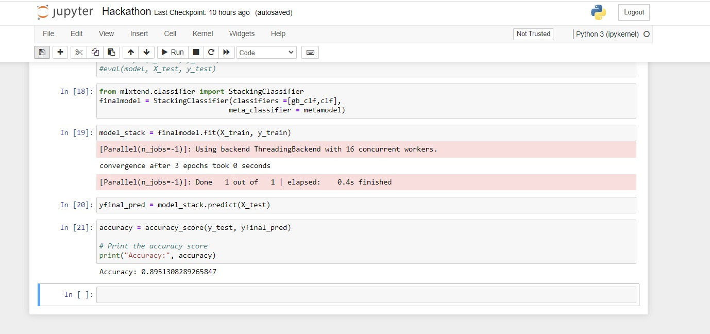

# Predictive Healthcare Modeling: Reducing Healthcare Costs
A machine learning model whose objective is to prevent unnecessary hospitalizations and consequently reduce healthcare expenditure per person.

## :innocent: Motivation
In the midst of the economic downturn and rising healthcare costs following the pandemic, there is a critical need to reduce healthcare spending and decrease the frequency of hospitalizations. This approach not only supports the alleviation of hospital overcrowding, considering preventative measures beyond the pandemic, but also contributes to lowering both individual and governmental healthcare expenses.

## :warning: Framework Used

- Python
- Data Science
- Machine Learning

## :information_source: About Project
The regression approach successfully addressed the problem statement in this project. The project demanded meticulous data preprocessing due to the provided dataset's intricate nature, consisting of 13 CSV files. As a team, we first gained a comprehensive understanding of the data and the desired output, leading to the systematic design of the system.

Data Preprocessing and Feature Extraction played a pivotal role in the design, given the disorderly nature of the data. Our process involved calculating the correlation coefficient between the output feature and all input features, handling missing and inconsistent data, employing the filter method to identify influential features, performing one-hot encoding for categorical features, utilizing the random forest classifier, and applying the wrapping method. From the initial 102 input features, we selected the top 70 based on their ranking.

For Data Modeling, we employed classification models for categorical data and regression models for numerical data. The decision tree classifier proved to be the most effective for the classification aspect, while the Gradient Boosting classifier excelled in addressing the regression problem. Combining these models through ensembling significantly enhanced the overall performance of the final model.

In the Prediction phase, we utilized the ensembled model to predict the optimized hospitalization days for patients.

## :rocket: Performance

### Decision Tree Classifier
The classifier worked with an accuracy of 85.01% on the testing data.

### Gradient Boosting Regression Model
The model worked with an accuracy of 89.3% on testing data.

### Ensembled Model
The ensembled model had an accuracy of 89.51%.

##  :desktop_computer: Output

## :file_folder: Dataset

https://drive.google.com/drive/folders/13GN2dHQ8BII4NabrjrPRSaB8p2bWz08F?usp=sharing
